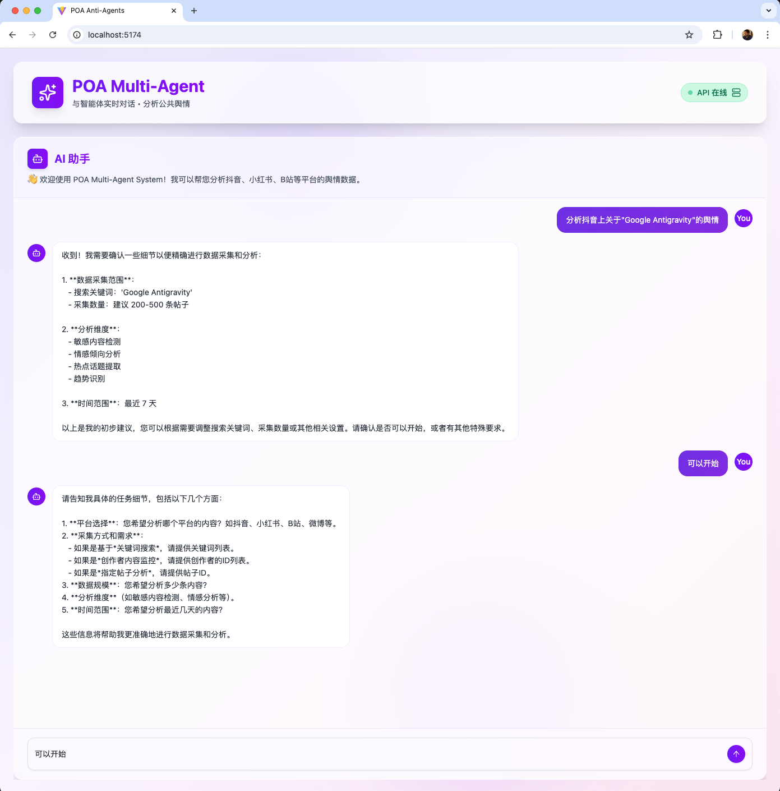
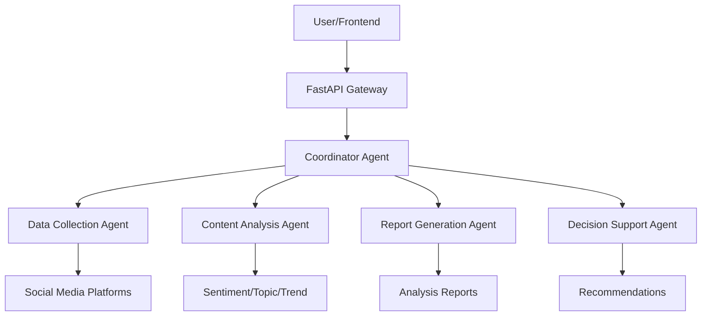

# POA Multi-Agent System

> An intelligent public opinion analysis platform powered by OpenAI's multi-agent framework

[](https://opensource.org/licenses/MIT)
[](https://www.python.org/downloads/)
[](https://nodejs.org/)
[](https://reactjs.org/)
[](https://fastapi.tiangolo.com/)

## Overview

POA (Public Opinion Analysis) Multi-Agent System is an intelligent analysis platform that leverages OpenAI's multi-agent framework to analyze public opinion across various Chinese social media platforms including:

- **Douyin (抖音)** - China's TikTok
- **Xiaohongshu (小红书)** - RED/Little Red Book
- **Bilibili (B站)** - Video sharing platform

The system uses coordinated AI agents to collect data, analyze sentiment, detect trends, identify risks, and generate comprehensive reports.

## 📸 Screenshot



*Modern chat interface for natural language interaction with AI agents*


## 🏗️ Project Structure

```
poa-multi-agent/
├── anti-agents/                    # Backend API service
│   ├── src/
│   │   ├── api/              # FastAPI application
│   │   ├── poa_agents/       # Multi-agent system
│   │   ├── schemas/          # Pydantic models
│   │   └── services/         # Business logic
│   ├── tests/                # Test suite
│   ├── docs/                 # Architecture & API docs
│   ├── examples/             # Usage examples
│   └── pyproject.toml        # Python dependencies
├── web/                      # Frontend React application
│   ├── src/
│   │   ├── components/       # React components
│   │   ├── services/         # API client
│   │   └── types/            # TypeScript types
│   ├── public/               # Static assets
│   └── package.json          # Node dependencies
├── docker-compose.yml        # Docker orchestration
├── start-dev.sh              # Development startup script
└── README.md                 # This file
```

## ✨ Features

### Multi-Agent Architecture
- **Coordinator Agent** - Orchestrates the entire analysis workflow
- **Data Collection Agent** - Gathers data from social media platforms
- **Content Analysis Agent** - Performs sentiment and topic analysis
- **Report Generation Agent** - Creates comprehensive reports
- **Decision Support Agent** - Provides actionable recommendations
- **Notification Agent** - Sends alerts and updates

### Analysis Capabilities
- 💬 **Sentiment Analysis** - Positive, negative, neutral classification with scores
- 📊 **Topic Detection** - Identify trending topics and keywords
- 📈 **Trend Analysis** - Track opinion trends over time
- ⚠️ **Risk Assessment** - Detect potential PR crises and sensitive content
- 🔍 **Sensitive Content Detection** - Automated content moderation
- 📝 **Report Generation** - Executive summaries and detailed analytics

### User Interface
- 🎨 **Modern Chat Interface** - Natural language interaction with AI agents
- 📊 **Interactive Dashboards** - Real-time data visualization with charts
- 🌐 **Multi-Platform Support** - Analyze multiple platforms simultaneously
- 🚀 **Real-Time Updates** - Live analysis results as they're processed

## 🚀 Quick Start

### Prerequisites

Ensure you have the following installed:

- **Python 3.12+** - [Download](https://www.python.org/downloads/)
- **Node.js 18+** - [Download](https://nodejs.org/)
- **PostgreSQL** - For session storage (optional for development)
- **Redis** - For caching (optional for development)
- **uv** - Fast Python package installer: `pip install uv`

### Environment Setup

1. **Clone the repository**
   ```bash
   git clone https://github.com/yourusername/poa-multi-agent.git
   cd poa-multi-agent
   ```

2. **Set up environment variables**
   ```bash
   # Backend
   cd anti-agents
   cp .env.example .env
   # Edit .env and add your OpenAI API key and other configs
   
   # Frontend
   cd ../web
   cp .env.example .env
   # Configure API endpoint if needed
   ```

### Option 1: One-Command Startup (Recommended)

Use the startup script to run both backend and frontend:

```bash
./start-dev.sh
```

This will:
- ✅ Check all prerequisites
- ✅ Install dependencies
- ✅ Create .env files if missing
- ✅ Start backend API server
- ✅ Start frontend dev server
- ✅ Display service URLs

### Option 2: Manual Setup

**Backend:**
```bash
cd anti-agents
uv sync                      # Install Python dependencies
make run-api                 # Start FastAPI server
```

**Frontend:**
```bash
cd web
npm install                  # Install Node dependencies
npm run dev                  # Start Vite dev server
```

### Option 3: Docker Compose

```bash
docker-compose up -d         # Start all services
docker-compose logs -f       # View logs
docker-compose down          # Stop all services
```

## 🌐 Access the Application

Once services are running:

| Service | URL | Description |
|---------|-----|-------------|
| **Frontend UI** | http://localhost:5173 | Chat interface for analysis |
| **Backend API** | http://localhost:8100 | REST API server |
| **API Docs (Swagger)** | http://localhost:8100/docs | Interactive API documentation |
| **API Docs (ReDoc)** | http://localhost:8100/redoc | Alternative API documentation |

## 📖 Usage

### Web Interface

1. Open http://localhost:5173 in your browser
2. You'll see a chat interface with quick-start prompts
3. Click a prompt or type your own query, for example:
   - "分析抖音上关于'人工智能'的舆情，最近7天"
   - "检测小红书上的敏感内容"
   - "分析B站上的热门话题趋势"
4. The AI agents will process your request and display results

### API Usage

```python
import requests

# Submit an analysis request
response = requests.post(
    "http://localhost:8100/api/v1/analysis",
    json={
        "request": "分析抖音上关于'人工智能'的舆情",
        "max_turns": 20
    }
)

result = response.json()
print(result)
```

See [anti-agents/examples/api_client_example.py](anti-agents/examples/api_client_example.py) for more examples.

## 🛠️ Technology Stack

### Backend (anti-agents/)

| Technology | Purpose |
|------------|---------|
| **FastAPI** | Modern, high-performance web framework |
| **OpenAI Agents** | Multi-agent orchestration framework |
| **SQLAlchemy** | SQL toolkit and ORM |
| **PostgreSQL** | Relational database for sessions |
| **Redis** | In-memory cache |
| **Pydantic** | Data validation |
| **uvicorn** | ASGI server |

### Frontend (web/)

| Technology | Purpose |
|------------|---------|
| **React 19** | User interface library |
| **TypeScript** | Type-safe JavaScript |
| **Vite** | Fast build tool |
| **Recharts** | Data visualization library |
| **Lucide React** | Icon library |
| **Axios** | HTTP client |

## 📚 Documentation

- **Architecture Design**: [anti-agents/docs/MULTI_AGENT_ARCHITECTURE_DESIGN.md](anti-agents/docs/MULTI_AGENT_ARCHITECTURE_DESIGN.md)
- **API Reference**: http://localhost:8100/docs (when running)
- **Contributing Guide**: [CONTRIBUTING.md](CONTRIBUTING.md)

## 🧪 Development

### Running Tests

**Backend:**
```bash
cd anti-agents
make test                    # Run all tests
make test-cov                # Run with coverage report
```

**Frontend:**
```bash
cd web
npm test                     # Run tests
npm run test:coverage        # Run with coverage
```

### Code Quality

**Backend:**
```bash
cd anti-agents
make lint                    # Run ruff linter
make format                  # Format code
make type-check              # Run type checker
```

**Frontend:**
```bash
cd web
npm run lint                 # Run ESLint
npm run lint:fix             # Auto-fix issues
npm run type-check           # TypeScript check
```

### Adding New Agents

1. Create agent in `anti-agents/src/poa_agents/`
2. Define agent instructions and tools
3. Register agent in coordinator
4. Add tests in `anti-agents/tests/`
5. Update documentation

See the [Multi-Agent Architecture Guide](anti-agents/docs/MULTI_AGENT_ARCHITECTURE_DESIGN.md) for details.

## 🐳 Docker

### Development Mode

```bash
docker-compose up -d
```

Services included:
- PostgreSQL (port 5432)
- Redis (port 6379)
- Backend API (port 8100)
- Frontend (port 5173)

### Production Build

```bash
# Build images
docker-compose -f docker-compose.prod.yml build

# Run in production mode
docker-compose -f docker-compose.prod.yml up -d
```

## 📊 Architecture




### Development Workflow

1. Fork the repository
2. Create a feature branch: `git checkout -b feature/amazing-feature`
3. Make your changes
4. Run tests and linting
5. Commit: `git commit -m 'Add amazing feature'`
6. Push: `git push origin feature/amazing-feature`
7. Open a Pull Request

## 🔒 Security

- Never commit `.env` files with real credentials
- Use environment variables for sensitive data
- Keep OpenAI API keys secure
- Regularly update dependencies

## 📝 License

This project is licensed under the MIT License - see the [LICENSE](LICENSE) file for details.

## 🙏 Acknowledgments

- **OpenAI** - For the Agents framework
- **FastAPI** - For the excellent web framework
- **React Community** - For the UI ecosystem

## 📞 Support

- **Issues**: [GitHub Issues](https://github.com/yourusername/poa-multi-agent/issues)
- **Discussions**: [GitHub Discussions](https://github.com/yourusername/poa-multi-agent/discussions)
- **Email**: support@example.com

## 🗺️ Roadmap

- [ ] Add WeChat (微信) platform support
- [ ] Implement real-time streaming analysis
- [ ] Add multi-language support (English, Chinese)
- [ ] Create mobile app (iOS/Android)
- [ ] Add data export features (PDF, Excel)
- [ ] Implement user authentication and multi-tenancy
- [ ] Add scheduled analysis jobs
- [ ] Create admin dashboard
- [ ] Improve AI model fine-tuning capabilities

---

**Version**: 0.1.0  
**Last Updated**: 2025-11-22  
**Status**: 🚧 Active Development

Made with ❤️ by the POA Team
